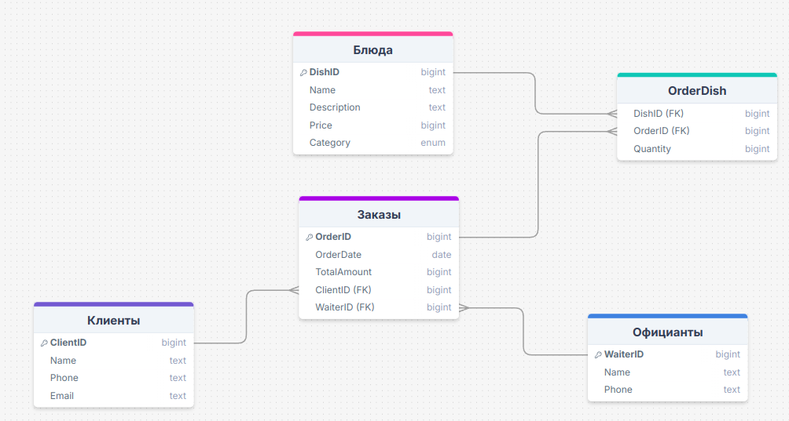
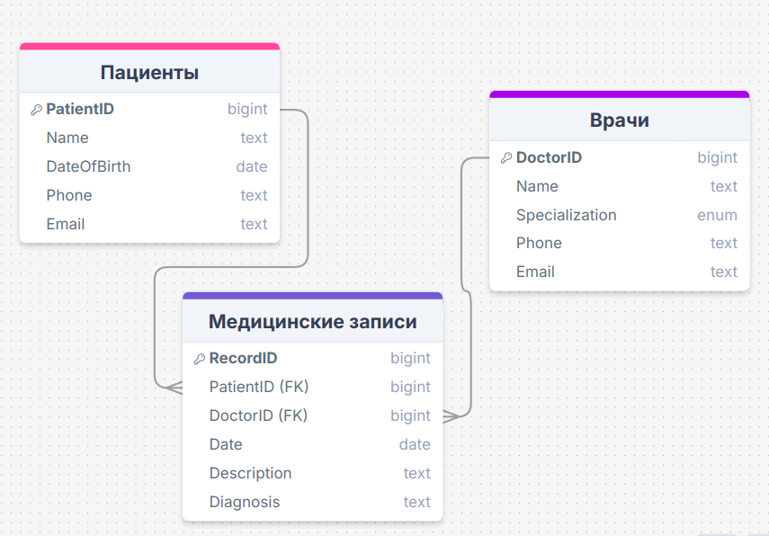

```
Вариант 5
Задача 1: Определение модели данных для управления заказами в ресторане
Создайте модель данных для системы управления заказами в ресторане. В системе должны учитываться блюда, официанты и клиенты.
Задача 2: Определение связей между сущностями
Определите связи между блюдами, заказами и клиентами. Один заказ может включать
несколько блюд, а один клиент может сделать несколько заказов. Определите типы связей между этими сущностями.
Задача 3: Построение ER-диаграммы
Постройте ER-диаграмму для описанной модели данных с использованием PlantUML. Описать сущности для блюд, заказов и клиентов и указать связи между ними.
```
### Задача 1
**Блюда**
	`DishId` - уникальный идентификатор блюда
	`Name` - название блюда
	`Description` - описание блюда
	`Price` - цена блюда
	`Category` - категория блюда
**Заказы**
	`OrderID` - уникальный идентификатор заказа
	`OrderDate` - дата и время заказа
	`TotalAmount` - общая сумма заказа
	`ClientID` - идентификатор клиента, который сделал заказ
	`WaiterID` - идентификатор официанта, который обслуживал заказ
**Клиенты**
	`ClientID` - уникальный идентификатор клиента
	`Name` - имя клиента
	`Phone` - телефон клиента
	`Email` - электронная почта клиента
**Официанты**
	`WaiterID` - уникальный идентификатор официанта
	`Name` - имя официанта
	`Phone` - телефон официанта
### Задача 2
**Заказы и блюда**
	Один заказ может включать несколько блюд, и одно блюдо может быть в нескольких заказах. Это связь ***многие ко многим***. Для реализации такой связи понадобится промежуточная таблица:
	**OrderDIsh**
		`OrderID` - идентификатор заказа
		`DishID` - идентификатор блюда
		`Quantity` - количество данного блюда в заказе
**Заказы и клиенты**
	Один клиент может сделать несколько заказов, но один заказ принадлежит только одному клиенту. Это связь ***один ко многим***. В таблице заказов будет атрибут `ClientID`, который ссылается на `ClientID` в таблице клиентов.
**Заказы и официанты**
	Один официант может обслуживать несколько заказов, но один заказ обслуживается только одним официантом. Это связь ***один ко многим***. В таблице заказов будет атрибут `WaiterID`, который ссылается на `WaiterID` в таблице официантов.
### Задача 3
ER диаграмма:


```
Вариант 6
Задача 1: Определение модели данных для управления пациентами и медицинскими
записями
Создайте модель данных для управления медицинскими записями пациентов в больнице. В системе должны учитываться пациенты, врачи и медицинские записи.
Задача 2: Определение связей между сущностями
Определите связи между пациентами, врачами и медицинскими записями. Один пациент может наблюдаться у нескольких врачей, а один врач может вести несколько пациентов. Определите типы этих связей.
Задача 3: Построение ER-диаграммы
Постройте ER-диаграмму для описанной модели данных с использованием PlantUML. Описать сущности для пациентов, врачей и медицинских записей и указать связи между ними.
```
### Задача 1
**Пациенты**
	`PatientID` - уникальный идентификатор пациента
	`Name` - имя пациента
	`DateOfBirth` - дата рождения
	`Phone` - номер телефона
	`Email` - электронная почта
**Врачи**
	`DoctorID` - уникальный идентификатор врача
	`Name` - имя врача
	`Specialization` - специализация врача
	`Phone` - номер телефона
	`Email` - электронная почта
**Медицинские записи**
	`RecordID` - уникальный идентификатор медицинской записи
	`PatientID` - идентификатор пациента, к которому относится запись
	`DoctorID` - идентификатор врача, который ведет запись
	`Date` - дата записи
	`Description` - описание записи
	`Diagnosis` - диагноз
### Задача 2
**Пациенты и врачи**
	Один пациент может наблюдаться у нескольких врачей, и один врач может вести несколько пациентов. Это связь ***многие ко многим***. Для реализации такой связи понадобится промежуточная таблица:
	**PatientDoctor**
		`PatientID` - идентификатор пациента
		`DoctorID` - идентификатор врача
**Пациенты и медицинские записи**
	Один пациент может иметь несколько медицинских записей, но каждая медицинская запись относится только к одному пациенту. Это связь ***один ко многим***. В таблице медицинских записей будет атрибут `PatientID`, который ссылается на `PatientID` в таблице пациентов.
**Врачи и медицинские записи**
	Один врач может вести несколько медицинских записей, но каждая медицинская запись относится только к одному врачу. Это связь ***один ко многим***. В таблице медицинских записей будет атрибут `DoctorID`, который ссылается на `DoctorID` в таблице врачей.
### Задача 3
ER диаграмма:

